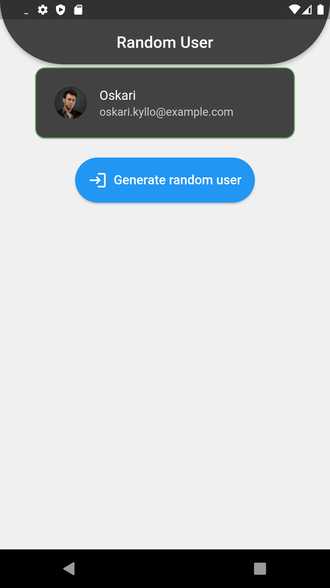

# Random User

🚀 Esse projeto foi utilizado para demonstrar os meus conhecimentos no consumo de API's e construir minhas tela a partir do consumo da API RANDOM USER GENERATOR🚀

### Pré-requisitos

Antes de começar, você vai precisar ter instalado em sua máquina as seguintes ferramentas:

Além disto é bom ter um editor para trabalhar com o código como [VSCode](https://code.visualstudio.com/) e Android Studio (https://developer.android.com/studio)

* Realize o download do projeto

1. git clone https://github.com/lucasrp98/random_user
2. instale o emulador no Andoid Studio
3. inicialize o emulador ou utilize o seu smartphone como emulador

### 🛠 Tecnologias

As seguintes ferramentas foram usadas na construção do projeto:

- [Flutter](https://flutter.dev/)

### Status
<h4 align="center"> 
	🚧  Flutter Select 🚀 Em construção ...  🚧
</h4>

### Screenshots

Página Inicial: Nesta tela é onde ocorre o funcionamento do aplicativo, no qual usuário clica em um botão e se altera o usuário.

<h1 align="center">
  
</h1>

### Autor

Feito de ❤️ por Lucas Ribeiro👋🏽 Entre em contato!

<h1 align="center">
  
</h1>

   

